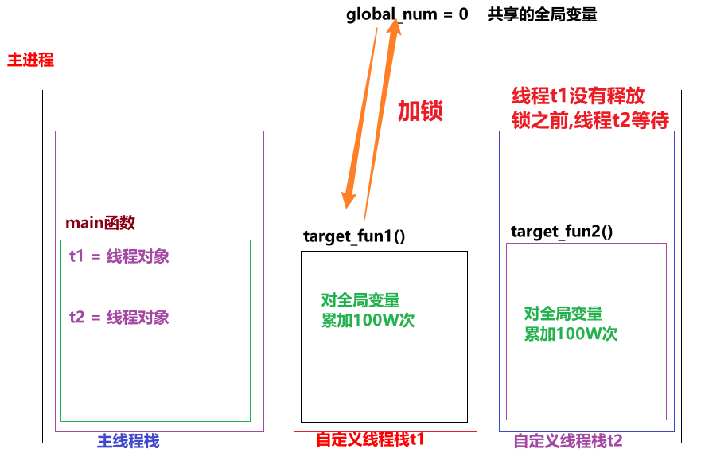

## 多线程特点_随机性

```python
"""
案例: 演示多线程特点.

多线程特点:
    1. 线程执行具有随机性, 原因是因为CPU在做着高效的切换.
    2. 默认情况下, 主线程会等待子线程结束再结束.
    3. (同一个进程的)线程间 数据共享。
    4. 多线程操作共享数据， 可能会出现安全问题， 可以用 互斥锁解决。

CPU调度资源的策略：
    1.均分时间片
    2.抢占式调度
"""
# 需求: 创建多个线程, 多次运行, 观察结果.

# 导包
import threading
import time


# 1.定义多线程的目标函数.
def print_info():
    # 1.1 休眠
    time.sleep(0.2)
    # 1.2 获取当前线程对象.
    current_thread = threading.current_thread()
    # 1.3 打印当前线程的名字.
    print(current_thread.name)

# 2. 测试
if __name__ == '__main__':
    # 2.1 创建10个线程, 观察其运行效果.
    for i in range(10):
        t = threading.Thread(target=print_info)
        t.start()
```

## 多线程特点_守护线程

```python
"""
案例: 演示多线程特点之 守护线程.

多线程特点:
    1. 线程执行具有随机性, 原因是因为CPU在做着高效的切换.
    2. 默认情况下, 主线程会等待子线程结束再结束.
    3. (同一个进程的)线程间 数据共享。
    4. 多线程操作共享数据， 可能会出现安全问题， 可以用 互斥锁解决。

"""
# 导包
import threading, time

# 1.定义目标函数.
def work():
    for i in range(10):
        time.sleep(0.2)
        print('工作中...')


# 2. 测试.
if __name__ == '__main__':
    # 2.1 创建(子)线程对象.
    # (守护线程)写法1: daemon属性
    # t = threading.Thread(target=work, daemon=True)

    # (守护线程)写法2: setDaemon()函数, 已过时(暂时还支持, 以后的新版本中可能会被移除掉).
    # t = threading.Thread(target=work)
    # t.setDaemon(True)

    # (守护线程)写法3: daemon属性
    t = threading.Thread(target=work)
    t.daemon = True

    # 2.2 启动线程.
    t.start()

    # 2.3 设置主线程休眠时间1秒
    time.sleep(1)
    # 2.4 设置主线程的结束标记.
    print('主线程结束了!')

```

## 多线程特点_数据共享

```python
"""
案例: 演示多线程特点之 数据共享.

多线程特点:
    1. 线程执行具有随机性, 原因是因为CPU在做着高效的切换.
    2. 默认情况下, 主线程会等待子线程结束再结束.
    3. (同一个进程的)线程间 数据共享。
    4. 多线程操作共享数据， 可能会出现安全问题， 可以用 互斥锁解决。

"""

# 需求: 定义全局变量my_list = [], 定义两个目标函数分别实现添加, 查看数据. 最后创建两个线程, 分别执行对应的任务, 观察结果.

# 导包
import threading, time

# 1.定义全局变量
my_list = []

# 2. 定义目标函数, 添加数据.
def write_data():
    for i in range(1, 6):
        my_list.append(i)
        print("写入数据: ", i)
    print(f'write_data函数: {my_list}')

# 3. 定义目标函数, 查看数据.
def read_data():
    # 休眠, 即: 等待write_data()执行结束在结束.
    time.sleep(2)
    print(f'read_data函数: {my_list}')

# 4. 测试
if __name__ == '__main__':
    # 4.1 创建线程对象, 并且启动线程.
    t1 = threading.Thread(target=write_data)
    t2 = threading.Thread(target=read_data)

    # 4.2 启动线程.
    t1.start()
    t2.start()

```

## 多线程特点_互斥锁

* 图解

  

* 代码

  ```python
  """
  案例: 演示多线程共享全局变量, 可能出现的问题.
  
  多线程共享全局变量, 出现问题的问题:
      累加次数不够.
  产生原因:
      线程1还没有来记得执行完(一个完整的动作)前, 被线程2抢走了资源, 就可能出问题.
  解决方案:
      加锁思想, 即: 互斥锁.
  
  细节:
      使用互斥锁的时候, 要在合适的时机释放所, 否则可能出现 死锁 或者 锁不住的情况.
  """
  
  # 需求: 定义两个函数, 分别对全局变量累加100W次, 创建两个线程, 关联这两个函数, 执行看效果.
  # 导包
  import threading
  
  # 1.定义全局变量.
  global_num = 0
  
  # 创建线程锁.
  mutex = threading.Lock()
  # mutex2 = threading.Lock()
  
  # 2.定义目标函数1, 对全局变量累加100W次.
  def target_fun1():
      mutex.acquire()     # 加锁
      # 2.1 声明为全局变量
      global global_num
      # 2.2 遍历100W次, 对全局变量进行累加.
      for i in range(1000000):
          # 2.3 具体的累加动作
          global_num += 1
      # 2.4 累加完毕后, 打印结果.
      print(f'target_fun1函数结果: {global_num}')
      mutex.release()     # 释放锁
  
  # 3.定义目标函数2, 对全局变量累加100W次.
  def target_fun2():
      mutex.acquire()  # 加锁
      global global_num
      for i in range(1000000):
          global_num += 1
      print(f'target_fun2函数结果: {global_num}')
      mutex.release() # 释放锁
  
  # 4.测试.
  if __name__ == '__main__':
      # 4.1 创建两个线程, 分别关联上述的两个目标函数.
      t1 = threading.Thread(target=target_fun1)
      t2 = threading.Thread(target=target_fun2)
  
      # 4.2 开启线程.
      t1.start()
      t2.start()
  ```

## 进程和线程对比

> ```python
> 进程和线程的区别:
>     1. 线程依赖进程, 进程是CPU分配资源的基本单位, 线程是CPU调度资源的基本单位.
>     2. 进程更消耗资源, 不能共享全局变量, 相对更稳定.
>     3. 线程更轻量级, 可以共享全局变量, 相对更灵活.
> ```

## 迭代器入门

```python
"""
案例: 演示自定义迭代器.

迭代器介绍:
    概述:
        自定义的类, 只要重写了 __iter__() 和 __next__() 方法, 就可以称为 迭代器.
    目的:
        隐藏底层的逻辑, 让用户使用更方便.
        惰性加载, 用的时候才会获取.

回顾: for循环格式
    for i in 可迭代类型:
        pass
"""
# 需求: 模拟range(1, 6), 自定义 迭代器实现同等逻辑.
# 场景1: 回顾 range()用法.
for i in range(1, 6):
    print(i)
print('-' * 23)


# 场景2: 自定义迭代器.
# 1. 自定义 迭代器类.
class MyIterator:
    # 2. 通过init魔法方法, 初始化属性, 指定: 范围.
    def __init__(self, start, end):
        self.current_value = start      # 当前值, 默认为 开始值.
        self.end = end                  # 结束值.

    # 3. 重写iterator魔法方法, 返回当前对象(即: 迭代器对象).
    def __iter__(self):
        return self

    # 4. 重写next魔法方法, 返回当前值, 并更新当前值.
    def __next__(self):
        # 4.1 判断当前值范围是否合法.
        if self.current_value >= self.end:
            raise StopIteration     # 抛出异常, 迭代结束.

        # 4.2 走这里, 说明当前值合法, 返回当前值, 并更新当前值.
        # value = self.current_value      # value =               1   2   3   4   5
        # self.current_value += 1         # self.current_value =  2   3   4   5   6
        # return value                    #                       1   2   3   4   5

        # 效果同上, 代码更简单
        self.current_value += 1          # self.current_value =  2   3   4   5   6
        return self.current_value - 1    #                       1   2   3   4   5


# 5. 创建迭代器对象, 并遍历.
# 5.1 for循环
for i in MyIterator(1, 6):
    print(i)
print('-' * 23)

# 5.2 next()函数
my_itr = MyIterator(10, 13)
print(next(my_itr)) # 10
print(next(my_itr)) # 11
print(next(my_itr)) # 12
# print(next(my_itr)) # raise StopIteration     # 抛出异常, 迭代结束.
```

## 生成器介绍

* **案例1: 推导式写法**

  ```python
  """
  案例: 演示生成器之 推导式写法.
  
  生成器介绍:
      概述:
          所谓的生成器就是基于 数据规则, 用一部分在生成一部分, 而不是一下子生成完所有.
      目的:
          可以节省大量的内存.
      实现方式:
          1. 推导式写法.
          2. yield关键字
  """
  import sys      # system: 系统模块
  
  # 场景1: 生成器 推导式写法.
  # 需求1: 生成1 ~ 10之间的整数.
  my_generator = (i for i in range(1, 11))
  print(my_generator)
  print(type(my_generator))   # <class 'generator'>
  print('-' * 23)
  
  # 需求2: 生成 1 ~ 10 之间的偶数.
  my_gt2 = (i for i in range(1, 11) if i % 2 == 0)
  print(my_gt2)
  print('-' * 23)
  
  # 需求3: 如何从生成器中获取数据.
  # 思路1: next()
  print(next(my_gt2))     # 2
  print(next(my_gt2))     # 4
  print('*' * 23)
  for i in my_gt2:
      print(i)            # 6, 8, 10
  print('-' * 23)
  
  # 验证 生成器的目的 就是可以减少内存占用.
  my_list = [i for i in range(1000000)]
  my_gt3 = (i for i in range(1000000))
  print(type(my_list), type(my_gt3))
  
  
  # 查看my_list的内存空间占用.
  print(f'my_list的内存占用: {sys.getsizeof(my_list)}')    # 89095160
  print(f'my_gt3的内存占用: {sys.getsizeof(my_gt3)}')      # 192
  print('-' * 23)
  
  ```

* **案例2: yield关键字**

  ```python
  """
  案例: 演示生成器之 推导式写法.
  
  生成器介绍:
      概述:
          所谓的生成器就是基于 数据规则, 用一部分在生成一部分, 而不是一下子生成完所有.
      目的:
          可以节省大量的内存.
      实现方式:
          1. 推导式写法.
          2. yield关键字
  """
  
  # 需求: 通过yield方式, 获取到生成器之 1 ~ 10之间的整数.
  # 回顾: 推导式写法.
  my_g = (i for i in range(1, 11))
  
  # yield方式如下.
  # 1.定义函数, 存储到生成器中, 并返回.
  def my_fun():
      # my_list = []              # 创建
      # for i in range(1, 11):
      #     my_list.append(i)     # 添加
      # return my_list            # 返回
  
      # 效果类似于上边的代码.
      # yield在这里做了三件事儿: 1.创建生成器对象.  2.把值存储到生成器中.  3.返回生成器.
      for i in range(1, 11):
          yield i
  
  # 2.测试.
  my_g2 = my_fun()
  print(type(my_g2))  # <class 'generator'>
  
  print(next(my_g2))
  print(next(my_g2))
  print('-' * 23)
  for i in my_g2:
      print(i)
  ```

* **案例3: 批量歌词**

  ```python
  """
  案例: 基于传入的数值(每批次的歌词条数), 创建 生成器, 生成批次歌词.
  """
  import math
  
  # 需求: 基于文件中 周杰伦的歌词, 创建生成器, 根据传入的每批次的歌词条数, 生成歌词批次.
  # 1. 定义函数, 接收 每批次的歌词条数, 返回生成器.
  def dataset_loader(batch_size):     # 假设是 8条/批次
      """
      自定义的 歌词 批量生成器
      :param batch_size:  每批次的歌词条数
      :return: 生成器, 每个元素都是一批次的数据, 例如: (8条, 8条, 8条...)
      """
      # 1.1 读取文件数据.
      with open('./data/jaychou_lyrics.txt', 'r', encoding='utf-8') as src_f:
          # 1.2 一次读取所有行.
          # lines = [line.strip() for line in src_f.readlines()]
          lines = src_f.readlines()
  
          # 1.3 计算批次总数, 假设: 5批
          total_batch = math.ceil(len(lines) / batch_size)
  
          # 1.4 for循环方式, 获取到每批次的数据, 放到生成器中, 并返回.
          for idx in range(total_batch):      # idx的值: 0, 1, 2, 3, 4
              # 第1批歌词, 批次索引(idx=0), 歌词为: 第1条 ~ 第8条, 索引为: 0 ~ 7
              # 第2批歌词, 批次索引(idx=1), 歌词为: 第9条 ~ 第16条, 索引为: 8 ~ 15
              # 第3批歌词, 批次索引(idx=2), 歌词为: 第17条 ~ 第24条, 索引为: 16 ~ 23
              yield lines[idx * batch_size : idx * batch_size + batch_size]      # 第1批
  
  
  # 2. 测试.
  dl = dataset_loader(8)
  print(next(dl)) # 第1批
  print(next(dl)) # 第2批
  
  for batch_data in dl:
      print(batch_data)
  ```

## Property属性介绍

* **场景1: 装饰器用法**

  ```python
  """
  案例: 演示property属性的用法.
  
  property属性介绍:
      概述/目的/作用:
          把 函数 当做 变量来使用.
      实现方式:
          方式1: 装饰器.
          方式2: 类属性.
  
  
  property的装饰器用法:
      @property               修饰 获取值的函数
      @获取值的函数名.setter     修饰 设置值的函数
  
      之后, 就可以直接 .上述的函数名 来当做变量直接用.
  """
  
  # 需求: 定义学生类, 私有属性 age, 通过property实现简化调用.
  # 1. 定义学生类.
  class Student:
      # 1.1 私有属性.
      def __init__(self):
          self.__age = 18
  
      # 1.2 提供公共的方式方式
      @property
      def age(self):
          return self.__age
  
      @age.setter
      def age(self, age):
          # 可以在这里对传入的age值做判断, 但是一般不做, 重要字段才会做判断.
          # 因为实际开发中数据是从前端传过来的, 已经做过判断了, 这里做属于二次校验.
          self.__age = age
  
  # 2. 测试
  if __name__ == '__main__':
      # 2.1 创建学生对象.
      s = Student()
      # 2.2. 设置值
      s.age = 20
      # 2.3 获取值
      print(s.age)
  ```

* **场景2: 类属性**

  ```python
  """
  案例: 演示property属性的用法.
  
  property属性介绍:
      概述/目的/作用:
          把 函数 当做 变量来使用.
      实现方式:
          方式1: 装饰器.
          方式2: 类属性.
  
  
  property的装饰器用法:
      @property               修饰 获取值的函数
      @获取值的函数名.setter     修饰 设置值的函数
  
  property类属性的用法:
      类属性名 = property(获取值的函数名, 设置值的函数名)
  
      之后, 就可以直接 .上述的函数名 来当做变量直接用.
  """
  
  # 需求: 定义学生类, 私有 age属性, 通过property充当类属性用.
  # 1. 定义学生类.
  class Student:
      # 1.1 私有age属性.
      def __init__(self):
          self.__age = 20
  
      # 1.2 公共的访问方式.
      def get_age(self):
          return self.__age
  
      def set_age(self, age):
          self.__age = age
  
      # 1.3 封装上述的公共方式为 类属性
      # 参1: 获取值的函数名,    参2: 设置值的函数名
      age = property(get_age, set_age)
  
  # 2. 测试
  if __name__ == '__main__':
      # 2.1 创建学生对象.
      s = Student()
      # 2.2. 设置值
      s.age = 99
      # 2.3 获取值
      print(s.age)
  ```

## 正则表达式入门

```python
"""
案例: 演示正则表达式之 校验单个字符.

正则表达式介绍:
    概述:
        正确的, 符合特定规则的 字符串.
        Regular Expression, 正则表达式, 简称: re
    细节:
        1. 学正则表达式, 就是学正则表达式的规则, 你用不背, 网上一搜一大堆.
        2. 关于正则我对大家的要求是, 能用我们讲的规则, 看懂别人写的式子, 且会简单修改即可.
        3. 正则不独属于Python, 像Java, JavaScript, PHP, Go等都支持.
    步骤:
        1. 导包
            import re
        2. 正则匹配
            result = re.match('正则表达式', '要校验的字符串')       从前往后依次匹配,只要能匹配即可.
            result = re.search('正则表达式', '要校验的字符串')      分段查找.
        3. 获取匹配结果.
            result.group()
    正则常用的规则:
        .       代表任意的 1个字符, 除了 \n
        \.      取消.的特殊含义, 就是1个普通的.
        a       代表1个普通的字符 a
        [abc]   代表a,b,c中任意的1个字符
        [^abc]  代表除了a,b,c外, 任意的1个字符
        \d      代表数字, 等价于 [0-9]
        \D      代表非数字, 等价于 [^0-9]
        \s
        \S
        \w
        \W

        ^
        $

        *
        ?
        +
        {n}
        {n,}
        {n,m}

        |           代表 或者的意思
        ()
        \num

        扩展:
            (?P<分组名>)
            (?P=分组名)
"""

# 需求: 正则入门.

# 1.导包
import re

# 2.正则校验, 参1: 正则规则, 参2: 要被校验的字符串
# result = re.match('.it', 'ait')     # 匹配成功
# result = re.match('.it', '你it')    # 匹配成功
# result = re.match('.it', '你好it')   # 失败

# result = re.match('\.it', '你it')   # 失败
# result = re.match('\.it', '.it')   # 匹配成功

result = re.match('[ahg]it', 'ait') # 匹配成功
result = re.match('[ahg]it', 'hit') # 匹配成功
result = re.match('[ahg]it', 'git') # 匹配成功
result = re.match('[ahg]it', 'g it') # 失败


result = re.match('[^ahg]it', 'ait')  # 失败
result = re.match('[^ahg]it', 'x it') # 失败
result = re.match('[^ahg]it', 'xit') # 匹配成功
result = re.match('[^ahg]it', 'xitabcxyz') # 匹配成功, 从前往后匹配, 匹配到就返回.
result = re.match('[^ahg]it', 'abcxitabcxyz') # 失败, 从前往后依次查找.
# result = re.search('[^ahg]it', 'abcxitabcxyz') # 失败, 从前往后依次查找.


result = re.match('[3-7]it', '3it') # 匹配成功
result = re.match('[3-7]it', '-it') # 失败, [3-7]等价于[34567]


# 3.获取匹配结果.
if result:
    print(result.group())
else:
    print('匹配失败')
```

## 正则替换

```python
"""
案例: 演示正则替换.


回顾正则的使用步骤:
    1. 导包
        import re
    2. 正则匹配
        result = re.match('正则表达式', '要校验的字符串')       从前往后依次匹配,只要能匹配即可.
        result = re.search('正则表达式', '要校验的字符串')      分段查找.
        result = re.compile('正则表达式').sub(替换后的内容, 要被替换的字符串)          替换
    3. 获取匹配结果.
        result.group()
"""

# 导包
import re

# 1.定义字符串.
s = '开心你就大声笑,哈哈,呵呵,嘿嘿,嘻嘻,桀桀桀,啦啦啦夯'

# 2.把上述的 哈,呵,嘿,嘻,桀 替换为 ♥
#                     正则规则            新字符串   要被替换的字符串
result = re.compile('哈|呵|嘿|嘻|桀').sub('♥', s)

# 3.打印结果.
print(result)
print('-' * 23)

# 新版API(函数)的写法.
# 参1: 正则规则,  参2: 新字符串,  参3: 要被替换的字符串
result = re.sub('哈|呵|嘿|嘻|桀', '♣', s)
print(result)
```

## 正则表达式_校验单个字符

```python
"""
案例: 演示正则表达式之 校验单个字符.

正则表达式介绍:
    概述:
        正确的, 符合特定规则的 字符串.
        Regular Expression, 正则表达式, 简称: re
    细节:
        1. 学正则表达式, 就是学正则表达式的规则, 你用不背, 网上一搜一大堆.
        2. 关于正则我对大家的要求是, 能用我们讲的规则, 看懂别人写的式子, 且会简单修改即可.
        3. 正则不独属于Python, 像Java, JavaScript, PHP, Go等都支持.
    步骤:
        1. 导包
            import re
        2. 正则匹配
            result = re.match('正则表达式', '要校验的字符串')       从前往后依次匹配,只要能匹配即可.
            result = re.search('正则表达式', '要校验的字符串')      分段查找.
        3. 获取匹配结果.
            result.group()
    正则常用的规则:
        .       代表任意的 1个字符, 除了 \n
        \.      取消.的特殊含义, 就是1个普通的.
        a       代表1个普通的字符 a
        [abc]   代表a,b,c中任意的1个字符
        [^abc]  代表除了a,b,c外, 任意的1个字符
        \d      代表数字, 等价于 [0-9]
        \D      代表非数字, 等价于 [^0-9]
        \s      代表空白字符, 等价于 [\t\n\r]
        \S      代表非空白字符
        \w      代表非特殊字符, 即: 数字, 字母, 下划线, 汉字, [a-zA-Z0-9_汉字]
        \W      代表特殊字符, 非字母,数字,下划线,汉字

        ^
        $

        *
        ?
        +
        {n}
        {n,}
        {n,m}

        |           代表 或者的意思
        ()
        \num

        扩展:
            (?P<分组名>)
            (?P=分组名)
"""

# 需求: 正则入门.

# 1.导包
import re

# 2.正则校验, 参1: 正则规则, 参2: 要被校验的字符串
# result = re.match('.it', 'ait')     # 匹配成功
# result = re.match('.it', '你it')    # 匹配成功
# result = re.match('.it', '你好it')   # 失败

# result = re.match('\.it', '你it')   # 失败
# result = re.match('\.it', '.it')   # 匹配成功

result = re.match('[ahg]it', 'ait') # 匹配成功
result = re.match('[ahg]it', 'hit') # 匹配成功
result = re.match('[ahg]it', 'git') # 匹配成功
result = re.match('[ahg]it', 'g it') # 失败


result = re.match('[^ahg]it', 'ait')  # 失败
result = re.match('[^ahg]it', 'x it') # 失败
result = re.match('[^ahg]it', 'xit') # 匹配成功
result = re.match('[^ahg]it', 'xitabcxyz') # 匹配成功, 从前往后匹配, 匹配到就返回.
result = re.match('[^ahg]it', 'abcxitabcxyz') # 失败, 从前往后依次查找.
# result = re.search('[^ahg]it', 'abcxitabcxyz') # 失败, 从前往后依次查找.


result = re.match('[3-7]it', '3it') # 匹配成功
result = re.match('[3-7]it', '-it') # 失败, [3-7]等价于[34567]


result = re.match('a\\dhm', 'a1hm')   # 匹配成功
result = re.match('a\\dhm', 'a10hm')  # 失败

result = re.match('a\\Dhm', 'a!hm')  # 匹配成功
result = re.match('a\\Dhm', 'abhm')  # 匹配成功


result = re.match('a\\shm', 'abhm')  # 失败
result = re.match('a\\shm', 'a\thm')  # 匹配成功
result = re.match('a\\shm', 'a\nhm')  # 匹配成功
result = re.match('a\\shm', 'a hm')  # 匹配成功

result = re.match('a\\whm', 'a\thm')  # 失败
result = re.match('a\\whm', 'a!hm')  # 失败
result = re.match('a\\whm', 'axhm')  # 匹配成功
result = re.match('a\\whm', 'a_hm')  # 匹配成功
result = re.match('a\\whm', 'a6hm')  # 匹配成功
result = re.match('a\\whm', 'aYhm')  # 匹配成功
result = re.match('a\\whm', 'a夯hm') # 匹配成功

# 3.获取匹配结果.
if result:
    print(result.group())
else:
    print('匹配失败')

```

## 正则表达式_校验多个字符

```python
"""
案例: 演示正则表达式之 校验单个字符.

正则表达式介绍:
    概述:
        正确的, 符合特定规则的 字符串.
        Regular Expression, 正则表达式, 简称: re
    细节:
        1. 学正则表达式, 就是学正则表达式的规则, 你用不背, 网上一搜一大堆.
        2. 关于正则我对大家的要求是, 能用我们讲的规则, 看懂别人写的式子, 且会简单修改即可.
        3. 正则不独属于Python, 像Java, JavaScript, PHP, Go等都支持.
    步骤:
        1. 导包
            import re
        2. 正则匹配
            result = re.match('正则表达式', '要校验的字符串')       从前往后依次匹配,只要能匹配即可.
            result = re.search('正则表达式', '要校验的字符串')      分段查找.
        3. 获取匹配结果.
            result.group()
    正则常用的规则:9
        .       代表任意的 1个字符, 除了 \n
        \.      取消.的特殊含义, 就是1个普通的.
        a       代表1个普通的字符 a
        [abc]   代表a,b,c中任意的1个字符
        [^abc]  代表除了a,b,c外, 任意的1个字符
        \d      代表数字, 等价于 [0-9]
        \D      代表非数字, 等价于 [^0-9]
        \s      代表空白字符, 等价于 [\t\n\r]
        \S      代表非空白字符
        \w      代表非特殊字符, 即: 数字, 字母, 下划线, 汉字, [a-zA-Z0-9_汉字]
        \W      代表特殊字符, 非字母,数字,下划线,汉字

        ^
        $

        *       代表前边的内容 出现至少0次, 至多无数次
        ?       代表前边的内容 出现至少0次, 至多1次
        +       代表前边的内容 出现至少1次, 至多无数次
        {n}     代表前边的内容 恰好出现n次, 多一次,少一次都不行
        {n,}    代表前边的内容 至少出现n次, 至多无数次
        {n,m}   代表前边的内容 至少出现n次, 至多出现m次, 包左包右.

        |           代表 或者的意思
        ()
        \num

        扩展:
            (?P<分组名>)
            (?P=分组名)
"""


# 导包
import re

# 验证 *       代表前边的内容 出现至少0次, 至多无数次
result = re.match('.*hm.*', 'abchm123')     # 匹配成功
result = re.match('.*hm.*', 'hm123')        # 匹配成功
result = re.match('.*hm.*', 'abchm')        # 匹配成功

result = re.match('.+hm.*', 'abchm')        # 匹配成功
result = re.match('.+hm.*', 'hm123')        # 失败

result = re.match('.?hm.*', 'ahm123')       # 匹配成功
result = re.match('.?hm.*', 'hm123')        # 匹配成功
result = re.match('.?hm.*', 'abchm123')     # 失败


result = re.match(r'\d{3}hm\w{2,5}', '123hm123')     # 匹配成功
result = re.match(r'\d{3}hm\w{2,5}', '123hm12@')     # 匹配成功
result = re.match(r'\d{3}hm\w{2,5}', '123hmabcAB')   # 匹配成功
result = re.match(r'\d{3}hm\w{2,5}', '1234hm123')    # 失败
result = re.match(r'\d{3}hm\w{2,5}', '12hm123')      # 失败
result = re.match(r'\d{3}hm\w{2,5}', '123hm1@')      # 失败
result = re.match(r'\d{3}hm\w{2,5}', '123hmabcAB1')  # 失败


result = re.match(r'\d{3,}hm\w{2,5}', '12hmabcAB1')   # 失败
result = re.match(r'\d{3,}hm\w{2, 5}', '123hmabcAB1') # 失败, 注意空格
result = re.match(r'\d{3,}hm\w{2,5}', '123hmabc') # 匹配成功


# 验证 ?       代表前边的内容 出现至少0次, 至多1次
# 验证 +       代表前边的内容 出现至少1次, 至多无数次
# 验证 {n}     代表前边的内容 恰好出现n次, 多一次,少一次都不行
# 验证 {n,}    代表前边的内容 至少出现n次, 至多无数次
# 验证 {n,m}   代表前边的内容 至少出现n次, 至多出现m次, 包左包右.

# 查看结果.
print(result.group() if result else '未匹配')
```

## 正则表达式_校验开头和结尾

```python
r"""
案例: 演示正则表达式之 校验单个字符.

正则表达式介绍:
    概述:
        正确的, 符合特定规则的 字符串.
        Regular Expression, 正则表达式, 简称: re
    细节:
        1. 学正则表达式, 就是学正则表达式的规则, 你用不背, 网上一搜一大堆.
        2. 关于正则我对大家的要求是, 能用我们讲的规则, 看懂别人写的式子, 且会简单修改即可.
        3. 正则不独属于Python, 像Java, JavaScript, PHP, Go等都支持.
    步骤:
        1. 导包
            import re
        2. 正则匹配
            result = re.match('正则表达式', '要校验的字符串')       从前往后依次匹配,只要能匹配即可.
            result = re.search('正则表达式', '要校验的字符串')      分段查找.
        3. 获取匹配结果.
            result.group()
    正则常用的规则:9
        .       代表任意的 1个字符, 除了 \n
        \.      取消.的特殊含义, 就是1个普通的.
        a       代表1个普通的字符 a
        [abc]   代表a,b,c中任意的1个字符
        [^abc]  代表除了a,b,c外, 任意的1个字符
        \d      代表数字, 等价于 [0-9]
        \D      代表非数字, 等价于 [^0-9]
        \s      代表空白字符, 等价于 [\t\n\r]
        \S      代表非空白字符
        \w      代表非特殊字符, 即: 数字, 字母, 下划线, 汉字, [a-zA-Z0-9_汉字]
        \W      代表特殊字符, 非字母,数字,下划线,汉字

        ^       表示开头
        $       表示结尾

        *       代表前边的内容 出现至少0次, 至多无数次
        ?       代表前边的内容 出现至少0次, 至多1次
        +       代表前边的内容 出现至少1次, 至多无数次
        {n}     代表前边的内容 恰好出现n次, 多一次,少一次都不行
        {n,}    代表前边的内容 至少出现n次, 至多无数次
        {n,m}   代表前边的内容 至少出现n次, 至多出现m次, 包左包右.

        |           代表 或者的意思
        ()
        \num

        扩展:
            (?P<分组名>)
            (?P=分组名)
"""


# 导包
import re


# 正则匹配
# 需求1: 校验字符串必须以数字开头, 无论match(), 还是search()均是.  后边是啥无所谓.
# result = re.match(r'\d+.*', 'abc123xyz')        # 失败
# result = re.search(r'\d+.*', 'abc123xyz')       # 匹配成功
#
# result = re.match(r'^\d+.*', 'abc123xyz')        # 失败
# result = re.search(r'^\d+.*', 'abc123xyz')       # 失败


# 需求2: 校验字符串必须以数字开头, 以任意的3个字母结尾.
# result = re.search(r'^\d+.*[a-zA-Z]{3}', 'abc123xyz12')       # 失败
# result = re.search(r'^\d+.*[a-zA-Z]{3}', '123你好xyz12')       # 匹配成功
# result = re.search(r'^\d+.*[a-zA-Z]{3}$', '123你好abc12')      # 失败
# result = re.search(r'^\d+.*[a-zA-Z]{3}$', '123你好abc')        # 匹配成功


# 需求3: 校验手机号.  规则: 1.长度必须是11位   2.必须是纯数字.  3.第1位数字必须是1.   4.第2位数字可以是 3-9
result = re.match(r'^1[3-9]\d{9}$', '13112345678a')
result = re.match(r'^1[3-9]\d{9}$', '12112345678')

result = re.match(r'^1[3-9]\d{9}$', '13112345678')

# 打印匹配结果.
print(result.group() if result else '未匹配!')
```

## 正则表达式_校验分组

```python
r"""
案例: 演示正则表达式之 校验分组.

正则表达式介绍:
    概述:
        正确的, 符合特定规则的 字符串.
        Regular Expression, 正则表达式, 简称: re
    细节:
        1. 学正则表达式, 就是学正则表达式的规则, 你用不背, 网上一搜一大堆.
        2. 关于正则我对大家的要求是, 能用我们讲的规则, 看懂别人写的式子, 且会简单修改即可.
        3. 正则不独属于Python, 像Java, JavaScript, PHP, Go等都支持.
    步骤:
        1. 导包
            import re
        2. 正则匹配
            result = re.match('正则表达式', '要校验的字符串')       从前往后依次匹配,只要能匹配即可.
            result = re.search('正则表达式', '要校验的字符串')      分段查找.
        3. 获取匹配结果.
            result.group()
    正则常用的规则:9
        .       代表任意的 1个字符, 除了 \n
        \.      取消.的特殊含义, 就是1个普通的.
        a       代表1个普通的字符 a
        [abc]   代表a,b,c中任意的1个字符
        [^abc]  代表除了a,b,c外, 任意的1个字符
        \d      代表数字, 等价于 [0-9]
        \D      代表非数字, 等价于 [^0-9]
        \s      代表空白字符, 等价于 [\t\n\r]
        \S      代表非空白字符
        \w      代表非特殊字符, 即: 数字, 字母, 下划线, 汉字, [a-zA-Z0-9_汉字]
        \W      代表特殊字符, 非字母,数字,下划线,汉字

        ^       表示开头
        $       表示结尾

        *       代表前边的内容 出现至少0次, 至多无数次
        ?       代表前边的内容 出现至少0次, 至多1次
        +       代表前边的内容 出现至少1次, 至多无数次
        {n}     代表前边的内容 恰好出现n次, 多一次,少一次都不行
        {n,}    代表前边的内容 至少出现n次, 至多无数次
        {n,m}   代表前边的内容 至少出现n次, 至多出现m次, 包左包右.

        |           代表 或者的意思
        ()          代表 分组, 从左往右数, 第几个左小括号(, 就表示第几组
        \num        代表 引用第几组的内容.

        扩展:
            (?P<分组名>)   设置分组
            (?P=分组名)    使用分组
"""
# 导包
import re

# 需求: 在列表 fruits = ['apple', 'banana', 'orange', 'pear'], 匹配 apple, pear
# 1.定义水果列表
fruits = ['apple', 'banana', 'orange', 'pear']

# 2. 遍历, 获取到每种水果.
for fruit in fruits:
    # 3. 判断当前水果是否是 喜欢吃的水果.
    # 参1: 正则表达式, 参2: 要校验的字符串.
    if re.match('apple|pear', fruit):
        # 4. 走这里, 说明是喜欢吃的.
        print(f'喜欢吃: {fruit}')
    else:
        # 5. 走这里, 说明不是喜欢吃的.
        print(f'不喜欢吃: {fruit}')

```

## 正则表达式_校验邮箱

```python
r"""
案例: 演示正则表达式之 校验邮箱.

正则规则:
    |           代表 或者的意思
    ()          代表 分组, 从左往右数, 第几个左小括号(, 就表示第几组
    \num        代表 引用第几组的内容.

    扩展:
        (?P<分组名>)   设置分组
        (?P=分组名)    使用分组
"""
# 导包
import re


# 1. 定义邮箱.
email = "abcd@163.com"

# 2. 校验邮箱是否合法.
result = re.match(r'^[a-zA-Z_0-9]{4,20}@(163|126|qq)\.com$', email)

# 3. 打印结果.
if result:
    print(f'合法邮箱为: {result.group()}')
    print(f'合法邮箱为: {result.group(0)}')  # 获取第0组的信息, 效果同上, 即: 整个匹配到的结果.
    print(f'合法邮箱为: {result.group(1)}')  # 获取第1组的信息,  即: 163
else:
    print("邮箱不合法!")
```

## 正则表达式_提取QQ号

```python
r"""
案例: 演示正则表达式之 校验邮箱.

正则规则:
    |           代表 或者的意思
    ()          代表 分组, 从左往右数, 第几个左小括号(, 就表示第几组
    \num        代表 引用第几组的内容.

    扩展:
        (?P<分组名>)   设置分组
        (?P=分组名)    使用分组
"""
import re

# 需求: 数据格式为 qq:数字,  从中提qq文本 和 qq号

# 1.定义变量, 记录要校验的字符串.
s = 'qq:123456'


# 2.正则校验.
result = re.match(r'^(qq):(\d{6,11})$', s)

# 3.提取内容.
if result:
    print(result.group())
    print(result.group(0))  # 效果同上.
    print('-' * 23)

    print(result.group(1))
    print(result.group(2))
else:
    print('未匹配')
```

## 正则表达式_校验html

```python
r"""
案例: 演示正则表达式之 校验邮箱.

正则规则:
    |           代表 或者的意思
    ()          代表 分组, 从左往右数, 第几个左小括号(, 就表示第几组
    \num        代表 引用第几组的内容.

    扩展:
        (?P<分组名>)   设置分组
        (?P=分组名)    使用分组


参考的html代码:
    <html>
        <head></head>       # 开始, 开放标签,    结束, 闭合标签.
        <body></body>
        <br />              # 自闭合标签.
    </html>
"""
import re


# 需求1: 校验html的单级标签.
# 1.定义变量, 记录: html标签.
# html_s = '<html>我是html页面</html>'        # 字母数: 1 ~ 4

# 2.匹配校验.
# 写法1: 重新copy一份.
# result = re.match('<[a-zA-Z]{1,4}>.*</[a-zA-Z]{1,4}>', html_s)

# 写法2: 引入分组的概念.
# result = re.match(r'<([a-zA-Z]{1,4})>.*</\1>', html_s)

# 3.打印结果.
# if result:
#     print(result.group())
# else:
#     print('未匹配!')


# 需求2: 校验html的单级标签.
# 1.定义变量, 记录: html标签.
html_s = '<html><h1>我是html页面</h1></html>'   # 字母数: 1 ~ 4,  标题标签1 ~ 6

# 2.匹配校验.
# 写法1: 重新copy一份.
# result = re.match(r'<[a-zA-Z]{1,4}><h[1-6]>.*</h[1-6]></[a-zA-Z]{1,4}>', html_s)

# 写法2: 引入分组的概念.
# result = re.match(r'<([a-zA-Z]{1,4})><(h[1-6])>.*</\2></\1>', html_s)

# 写法3: 给分组起名.
result = re.match(r'<(?P<A>[a-zA-Z]{1,4})><(?P<B>h[1-6])>.*</(?P=B)></(?P=A)>', html_s)

# 3.打印结果.
if result:
    print(result.group())
else:
    print('未匹配!')
```

